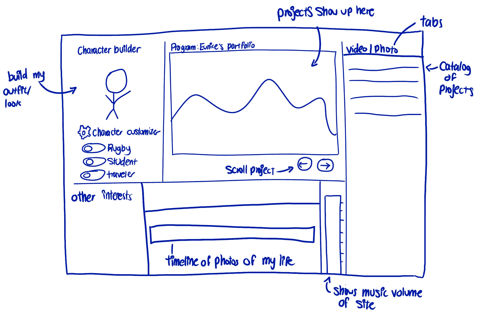

<mark>**Note that this document order from FP4 -> FP1**</mark>

<mark>Please sign up for the study</mark> at [https://tinyurl.com/pui-study](https://tinyurl.com/pui-study) to allow us to use your submission to create a better GenAI assistant for designers!

---

# **FP4 \- Final Project Writeup**

Feel free to refer to this [Markdown Cheat Sheet](https://www.markdownguide.org/cheat-sheet/) to make your writeup more organized, and you can preview your markdown file in VSCode [Markdown editing with Visual Studio Code](https://code.visualstudio.com/docs/languages/markdown#_markdown-preview). 

## Part 1: Website Description

Describe your website (300 words).

* What is the purpose of your website?   
* Who is the target audience?  
* What information do you convey with your website?   
* How is it interesting and engaging? 

## Part 2: User Interaction

How a user would interact with your website? For each step, briefly but clearly state the interaction type & how we should reproduce it.

1. Interaction type. Click on X on page Y / scroll on page X, etc.  
2. 

## Part 3: External Tool

Describe what important external tool you used (JavaScript library, Web API, animations, or other). Following the bulleted list format below, reply to each of the prompts.

1. Name of tool1  
   * Why did you choose to use it over other alternatives? (2 sentences max)  
   * How you used it? (2 sentences max)  
   * What does it add to your website? (2 sentences max)  
2. Name of tool2

## Part 4: Design Iteration

Describe how you iterated on your prototypes, if at all, including any changes you made to your original design while you were implementing your website and the rationale for the changes. (4-8 sentences max)

## Part 5: Implementation Challenge

What challenges did you experience in implementing your website? (2-4 sentences max)

## Part 6: Generative AI Use and Reflection

Describe how you used Generative AI tools to create this final project (fill in the following information, write \~500 words in total).

Document your use of all GenAI tools — ChatGPT, Copilot, Claude, Cursor, etc. using the template below. Add/Delete rows or bullet points if needed, and replace Tool1/Tool2 with the name of the tool.

### Usage Experiences by Project Aspects

Feel free to edit the column \_ (other?) or add more columns if there's any other aspect in your project you've used the GenAI tools for.

For the following aspects of your project, edit the corresponding table cell to answer:
- *Usage*: Whether you used / did not use this tool for the aspect. Enter [Yes/No]
- *Productivity*: Give a rating on whether this tool makes your productivity for X aspect [1-Much Reduced, 2-Reduced, 3-Slightly Reduced, 4-Not Reduced nor Improved, 5-Slightly Improved, 6-Improved, 7-Much Improved].

| Tool Name | Ratings | design | plan | write code | debug | \_ (other?) |
| :---- | :---- | :---- | :---- | :---- | :---- | :---- |
| Tool1 | Usage | Yes/No | Yes/No | Yes/No | Yes/No | Yes/No |
| Tool1 | Productivity | 1~7 | 1~7 | 1~7 | 1~7 | 1~7 |
| Tool2| Usage | Yes/No | Yes/No | Yes/No | Yes/No | Yes/No |
| Tool2 | Productivity | 1~7 | 1~7 | 1~7 | 1~7 | 1~7 |

### Usage Reflection

> Impact on your design and plan 
* It matched my expectations and plan in [FP2](#generative-ai-use-plan) in that … For example, 
  1. Tool1: 
  2. Tool2:
* It did not match my expectations and plan in [FP2](#generative-ai-use-plan) in that … For example, 
  1. Tool1: 
  2. Tool2:
* GenAI tool did/did not influence my final design and implementation plan because … For example, 
  1. Tool1: 
  2. Tool2:

> Use patterns
* I accepted the generations when …  For example, 
  1. Tool1: this tool once suggested … and I adjusted my design according to the suggestion because … 
  2. Tool2: 
* I critiqued/evaluated the generated suggestions by … For example, 
  1. Tool1: this tool once suggested … but I modified/rejected the suggestion because … 
  2. Tool2: 

> Pros and cons of using GenAI tools
* Pros
  1. Tool1: 
  2. Tool2:
* Cons
  1. Tool1: 
  2. Tool2:

### Usage Log

Document the usage logs (prompts and chat history links) for the GenAI tools you used. Some tools may not have an easy way to share usage logs, just try your best! Some instructions for different tools:

1. [ChatGPT](https://help.openai.com/en/articles/7925741-chatgpt-shared-links-faq) / [Gemini](https://support.google.com/gemini/answer/13743730?hl=en&co=GENIE.Platform%3DDesktop): share the anonymous link to all of your chat histories relevant to this project
2. [GitHub Copilot (VSCode)](https://code.visualstudio.com/docs/copilot/copilot-chat#:~:text=You%20can%20export%20all%20prompts%20and%20responses%20for%20a%20chat%20session%20in%20a%20JSON%20file%20with%20the%20Chat%3A%20Export%20Session...%20command%20(workbench.action.chat.export)%20in%20the%20Command%20Palette.): export chat histories relevant to this project.

---

# **FP3 \- Final Project Check-in**

Document the changes and progress of your project. How have you followed or changed your implementation & GenAI use plan and why? Remember to commit your code to save your progress.

## Implementation Plan Updates

- [ ] ...

## Generative AI Use Plan Updates

- [ ] ...

Remember to keep track of your prompts and usage for [FP4 writeup](#part-6-generative-ai-use-and-reflection).

---

# **FP2 \- Evaluation of the Final project**

## Project Description

This is a personal portfolio showcasing my works within different fields, including photography, videography, and product design. This portfolio is made with the Programmable User Interface (PUI) course requirements in mind, including (1) using an interesting tool/ set of user interactions, (2) accessibility design, and (3) responsive design. 

My portfolio is built with storytelling in mind, so it will incorporate video and animation components. It is built to look like a video editor because I use that program frequently for both personal and professional work.

## High-Fi Prototypes

### *Prototype 1*

Overall, people thought my design was creative and well thought out. They liked the interactivity I included and the idea of mixed media within the portfolio. Those who understood video editing softwares found it easier to find smaller “discoverable” features, but overall, the portfolio was straightforward to navigate.

[Figma Prototype](https://www.figma.com/proto/EYJzRCgiSNypChy2Ka6ahT/Personal-Portfolio?page-id=0%3A1&node-id=1-2&node-type=frame&viewport=743%2C-160%2C0.98&t=EXeejHUxyaXQCYzy-1&scaling=scale-down&content-scaling=fixed&starting-point-node-id=1%3A2)

## Usability Test

### Objective: 
To see if users can intuitively navigate the website, access the different portfolio pieces, and interact with “hidden features”.

  
Study Questions

  
**Landing page: (if made)**
- Is the introductory video informative? 

**Character customization feature:**
- Does this feature convey anything to you about the portfolio owner?

**Project selection retrieval:**
- Is it easy to navigate through the different projects? 
- Are the projects the focus of the portfolio?

**Life timeline interaction feedback:**
- How much information should be showcased in the life timeline? 
- Should there be a common theme within the events?

**Overall navigation and final thoughts**
- Are the mini-interactions distracting users from the project?
- What is the balance between a fun interaction and a practical interaction that showcases skill?

  
User Testing Walkthrough/Questions

**Introduction**
Greeting: Thank you for participating in this user testing session for my personal portfolio. As I decided to stylize my website in an unconventional way, the goal is to see how easily you can navigate the site and access different information within my portfolio.

Instructions: As you navigate the website, please think aloud and share any thoughts or questions you have as you explore its different components.

Background given: This portfolio is inspired by a video editor you may have used before.

**Possible questions after navigation**

1. Landing page:
- “What did you learn from the introduction video?”
- “If you were to reaccess this portfolio, would you rewatch the entire video?”

2. Character customization feature:
- Task: “Can you turn Eunice into a rugby player?”
- “Does this feature convey anything to you about the portfolio owner?”

3. Project selection retrieval:
- “Let's say you want to see the collection of videography projects. How would you do that?”
- Task: “Navigate to another project within the product tab.”

4. Life timeline interaction feedback:
- “How would you go about navigating the timeline?”
- Task: “Could you navigate to the time where…”
- “Is there a common theme to the different events in the timeline?”

5. Overall navigation and final thoughts:
- “Is anything about the navigation confusing?”
- “Did any of the mini-interactions cause more confusion than enjoyment?”
- “Does knowing how a video editor works help you navigate the site better?”

### Insights from user testing
**Intuitive use:** The layout is clean, but the character customizer section is imbalanced. The character screen and the toggle buttons look like separate features, as they are the same size. Additionally, one user’s first reaction was to press the space bar to play the timeline, just like in the video editor. As I did not consider this, this interaction did not do anything.

**Changes made:** I will change the character customizer toggle buttons to be smaller and make it so that pressing space will play a video prompting the user to click around instead

**Learnability:** The structure is simple, as it is all in one plaza. However, first-time visitors will need a guided walkthrough.

**Changes made:** I will create a video landing page of myself explaining my website. I will also implement some sort of visual feedback when clicking through sections.

**Accessibility:** The contrast between text and background is good, and the layout is spacious. However, some buttons and text are a bit small.

**Changes made:** I will change the text size and buttons to be bigger, and create a light-mode version of the website.

## Updated Designs

 

1. I will implement a (skippable) introduction video that acts as a landing page before you complete the website. It will be a video of me explaining the idea behind my portfolio and encouraging people to actively interact with it.

2. While I am focused on creating an immersive experience, I will create a light mode for my website to make it easier for people not familiar with editing software to read.

3. I changed the size of some of my website's features, including the character toggle buttons and the project buttons.

## Feedback Summary

The people in my lab session all expressed that my idea is very creative, and no one expressed any difficulty in understanding that my design is modeled after video editing software. They also thought the mini-interactions were a fun addition that possibly added to my personality profile (fidgety, with the need for stress relief).
However, they stressed the importance of providing context before accessing the website, which I plan on doing through a real-life video of me explaining my background and encouraging users to explore the website. My TA thought this was a good way of creating my landing page as it thematically relates to my portfolio.

I was encouraged to look into a JS library that implements video-playing features and animations so that I could execute my video player-vision. 

## Milestones

Outline weekly milestones to plan your expected implementation progress until the end of the semester (\~300 words). 

### *Implementation Plan*

- **[X] Week 9 Oct 28 \- Nov 1:**
  - [X] FP1 due
  
- **[ ] Week 10 Nov 4 \- Nov 8:**   
  - [X] FP2 due
  - Documentation Setup:
    - [ ] (optional) learn how to use and implement storybook
    - [ ]Connect Figma to working file
  - Research:
    - [ ] Get inspiration and create a list of required features from other people’s portfolios
    - [ ] Learn how to use the different JS libraries I will be implementing
  - Basic Structure Development:
    - [ ] Set up the basic HTML structure, including placeholders for each major section (eg. video player, character customization etc.)
    - [ ] Create well-named flexboxes in CSS to support responsive layout and styling adjustments
  -  Placeholders & Text:
    - [ ] Add placeholders for all icons and images to define layout and positioning 
    - [ ] Insert simple text for each section as a preview of the final content

-**[ ] Week 11 Nov 11 \- Nov 15:**
  - [ ] FP3 Due
    - Icon and Imagery Creation:
      - [ ] Design or gather all icons and visual elements needed for each feature.
      - [ ] Replace placeholders with finalized icons and images, adjusting sizes and positions as needed.
    - Interactivity and Styling Enhancements:
      - [ ] Implement primary JS functions to support interactions (eg. change font, light/dark mode, other accessibility features)
      - [ ] Fine-tune CSS for visual polish, adjusting colors, fonts, and layout details

- **[ ] Week 12 Nov 18 \- Nov 22:**
  - Project Navigator:
    - [ ] Begin loading all project files and assets into the website, ensuring each project is correctly categorized within its respective collection (e.g., Photography, Videography, Product)
    - [ ] Develop a collapsible list for easy navigation, allowing users to expand and collapse project categories
    - [ ] (Optional) Make the preview thumbnail “scruabble”
    - [ ] Integrate the video player with the Project Navigator, so selecting a project automatically loads it in the player for seamless viewing.
    - [ ] Implement a pop-up feature that enlarges projects when clicked, providing a closer look at project details
    - [ ] For projects that are external webpage links or documents, add a distinct visual cue (e.g., an icon or label) that indicates users can directly click to access the project.

- **[ ] Week 13 Nov 25 \- Nov 29 (Thanksgiving):**
    - Loading Screen:
      - [ ] Write a script for the loading screen video
      - [ ] Film and edit introduction video, including relevant imagery and captioning for accessibility
      - [ ] Implement a loading screen into the website, create buttons that allow you to play, pause, or fastforward the video

    - [ ] Catch up on any unfinished tasks from previous weeks

- **[ ] Week 14 Dec 2 \- Dec 6:**
  - [ ] FP4 due 
  - Final Debugging & Testing:
    - [ ] Conduct a debugging session to address layout, functionality, and performance issues
    - [ ] Run final accessibility checks for compatibility with screen readers, keyboard navigation, etc
  - Documentation:
    - [ ] Document the final implementation, including any features added or modified

### *Libraries and Other Components*

1. **Video.js** (https://videojs.com/)
 
Web video player that will allow me to create my loading page and display my different videography work within the website

2. **Anime.js** (https://animejs.com/)
 
A javascript animation library that could help with my customer characterization animations

3. **GSAP** (https://gsap.com/)
 
Another JS animation library
Features: Timeline control, easing functions, and ability to animate multiple properties

4. **Howler.js** (https://howlerjs.com/)
 
Supports multiple audio formats and sound sprites for my micro-interactions

## Generative AI Use Plan

I plan to leverage generative AI tools in design, development, and content creation. 

Starting with design, tools like Figma’s AI plugins or DALL-E will enable rapid prototyping of visual elements, such as custom icons, backgrounds, and layout ideas, allowing me to experiment with aesthetics efficiently. 

In development, I’ll use ChatGPT’s code generation to assist with complex coding features, like collapsible folders and interactive thumbnail scrubbers. These tools will provide optimized code suggestions and debugging support, ensuring smooth, responsive interactions. Additionally, generative AI will assist with brainstorming creative micro-interactions, such as a “fidget spinner” effect, by providing code examples I can refine and test. 

For content creation, I’ll use AI to draft concise, polished descriptions for each project, establishing a professional tone throughout the portfolio.

### *Tool Use*

* ChatGPT  
  * I will use it to debug code, as it can easily and efficiently identify wrong syntax and logic errors.
  * I will not use it for writing my entire code, as it may use different syntax/ formatting styles we are taught in class. 
* Bubble
  * I will use the build guide to learn how to implement certain features into my website.
  * I will not plagiarize off bubble.

### *Responsible Use*

* I can use AI to aid in coding assignments, but can only use it to augment existing work, not create solutions for me
* I will ensure to cite the usage of AI in my code and images
* I can use AI generation to create a broad high-level pseudocode, but not a step-by-step guide for lines of code

---

# **FP1 \- Proposal for Critique**

## Idea Sketches

### *Idea 1: Interactive Personal Portfolio*

Purpose: a personal portfolio for my photography/ videography/ product design work

- Fully interactive and fun to explore - make everything clickable
- Able to be read using a screenreader/ download a cv style version of the website
- Want to show my multifaceted skills in mixed media
- Emphasis on storytelling
- Designed to look like a video editor
- Questions: how can i make people want to explore the website, which in hand forces them to learn more about me?

- inspo: https://webflow.com/made-in-webflow/website/pierrelouis

### *Idea 2: Interactive “fridge” - recipe builder site*

Purpose: an interactive fridge that lets you click through ingredients, and it comes up with a list of recipes

- Utilizes a preloaded set of recipes I pick
- The ingredients are directly clickable
- For accessibility, the ingredients can also be changed to simple text for understanding
- Questions: How would I track what recipes show up for what ingredient? How many ingredients must there be for the recipe to show up?

### *Idea 3: 5 min tracker - where does your day go?*

Purpose: an interactive 15 minute tracker that lets you input your daily activities, and visualize it into a bar graph and a “story”

- I'm passionate about productivity and learning how to maximize your day
- As you edit your day, your graph changes
- For accessibility, make a way so that inputing your activities is easier, eg. sliders
- Question: how would i make everything change live and smoothly? What visualizations will I use?
 
## Feedback Summary

Everyone in my lab thought I had very creative ideas. One of my classmates asked how I would emphasize the storytelling element of my portfolio, and I think I want to incorporate some videography work into my portfolio to "tell my story". 

My TA stated that the portfolio idea is a great way to showcase the skills we learned in usability and interaction design, and supports iterative and incremental development, making it easy for me to visualize my progress.

Next, my fridge idea is fun and useful to me, and is quite similar to a potential project of another student, which might allow us to collaborate and support each other if we both happen to choose this project. However, there may be some complications with creating pre-loaded and labeled data.

Lastly, the third idea is relatively simple and clean, and is a tool that anyone can use. Some considerations I was given is how would i interpret somewhat arbitrary data and turn it into meaningful stories. The complication comes with the variability of input.

## Feedback Digestion

I think I will go with my portfolio idea. Not only does it allow me to showcase all the skills we learned in this class, it gives me "room to grow". As it does not require as much preplanning as my other projects,  it allows me to build upon it step by step as it has lots of space for manipulation and improvement. It will also be benefical to contain all my other projects as I'm busy looking for an internship. 

However, I'm still interested in my 15 minute tracker idea, and may try to learn how user generated data comes into play in development with the "build my character" mini game I want to include in my portfolio. I want the user to be able to manipulate my character to show my multifaceted interests and various skills, and I wonder if there is a way to ai generate different costumes depending on user input.

Now, my main concern is thinking of how it would visually look. I indicated that I wanted it to look like a video editing software, meaning that there will be minimal scrolling and that everything is placed onto one "dashboard screen", so I'm wondering if formating it would be too difficult. However, it does remind me how we formatted the notecards in lab activities, which is quite straightforward as long as I label my boxes properly, and use appropriate flex properities.
